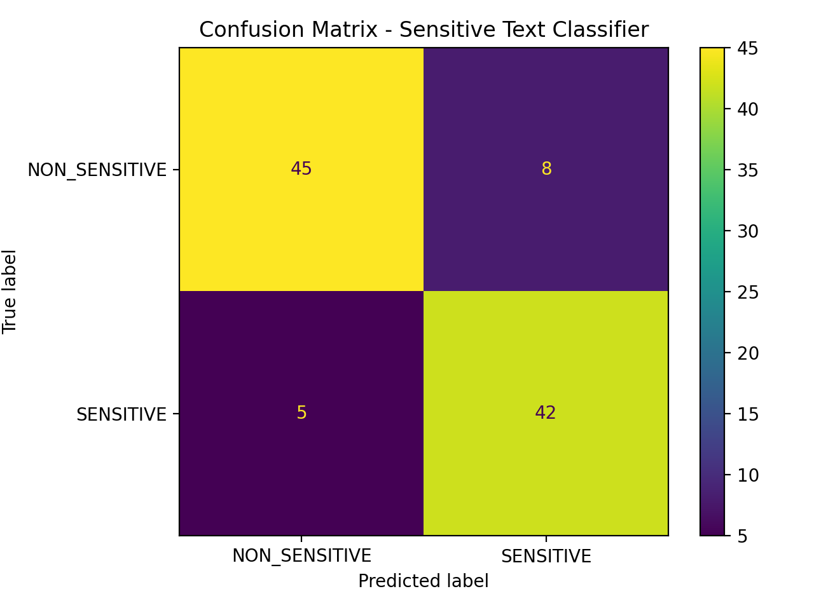

# AI Data Engine: Text Safety Evaluation

**TL;DR:** Label inconsistency (Kappa ~0.4–0.5) is the bottleneck. Improving **annotation quality—not model complexity** unlocks the next gains (F1: 0.866).

> Simulation of a production AI data engine for improving neural network performance through data quality.

> Focus: identifying and fixing data bottlenecks that limit neural network performance.

---

## Key Insight (What Actually Matters for AI Systems)

Model performance was not limited by the model.

Moderate inter-annotator agreement (Cohen’s Kappa ~0.4–0.5) revealed that inconsistent labeling was the primary constraint on performance.

I redesigned annotation logic and evaluation criteria to reduce ambiguity, demonstrating that improving data quality—not model complexity—is the highest-leverage path to better performance.

---

## Overview

This project implements a minimal AI data engine for sensitive text classification in safety-critical contexts.

**Problem:** Model performance plateaus due to ambiguous labeling and inconsistent annotation across edge cases.

It demonstrates how data quality, annotation consistency, and evaluation pipelines directly impact model performance.

---

## Data Engine Thinking

This project models a real-world ML pipeline:

Raw Data → Annotation → QA → Adjudication → Evaluation → Iteration

Key focus:
- identifying failure modes (false positives / false negatives)
- improving dataset quality instead of model complexity
- reducing ambiguity in labeling systems

This mirrors how large-scale ML systems (e.g., autonomous driving, content moderation) improve performance through iterative data refinement.

QA loop includes spot-checking, disagreement sampling, and guideline updates based on adjudication outcomes.

---

## Failure Modes Identified

- False positives caused by ambiguous phrasing  
- False negatives due to unclear labeling rules  
- Moderate annotator disagreement (Kappa ~0.4–0.5)  

**Example:**  
“I'm going to kill that presentation” → labeled inconsistently due to semantic ambiguity (literal threat vs figurative speech)

These indicate data quality—not model architecture—was the limiting factor.

---

## Next Iteration Plan (How I Would Improve This System)

- Refine annotation guidelines with stricter definitions and more edge-case examples  
- Introduce annotator calibration sessions to improve agreement  
- Implement confidence scoring for borderline classifications  
- Adjust classification thresholds to reduce false positives while maintaining recall  
- Expand dataset size to improve robustness across edge cases
- Run weekly calibration with a gold set (50–100 adjudicated examples) and require ≥90% agreement before labeling new batches

The goal is to increase inter-annotator agreement (Kappa > 0.7) and improve overall model reliability.

Target Kappa > 0.7 to reach “substantial agreement,” reducing label noise that caps model performance.

**Expected outcome:**  
Kappa > 0.7, Precision ≥ 0.85 with Recall ≥ 0.9 after guideline refinement and calibration.

**At scale:**  
This approach extends to millions of samples with distributed annotation, automated QA checks, and continuous model-data feedback loops.

---

## Results

*Evaluation based on a synthetic 100-sample dataset with binary labels (Sensitive vs Non-Sensitive).*

- Precision: 0.84  
- Recall: 0.89  
- F1 Score: 0.866  
- Accuracy: 0.87

*Evaluation:* held-out split from the synthetic dataset; metrics computed on the evaluation set.

*Class balance:* approximately balanced classes (~50/50 Sensitive vs Non-Sensitive).

---

## Evaluation Summary

The model performs well (F1: 0.866), but its performance ceiling is constrained by labeling inconsistency rather than model capability.

---

## Assumptions / Limitations

*Label definition:* “Sensitive” includes PII, threats, explicit content; “Non-Sensitive” includes benign commands and general text.

- Small synthetic dataset (n=100) → metrics are illustrative, not production-level
- Binary label space (Sensitive vs Non-Sensitive)
- Simulated annotators (no real crowd variance)
- No model retraining loop included (focus is data quality + eval)

---

## Confusion Matrix



---

## System Impact

This project demonstrates that:

- Data quality is the primary driver of model performance  
- Annotation consistency is critical for scaling ML systems  
- Evaluation frameworks must identify root causes, not just metrics  
- Model performance ceilings are often determined by data quality, not model architecture
- In production systems, improving annotation consistency often yields larger gains than increasing model complexity

---

## Repository Structure

```text
data/      Synthetic dataset
docs/      Annotation and evaluation documentation
outputs/   Confusion matrix visualization
src/       Python evaluation script
```

---

## How to Run

Tested with Python 3.14 on macOS; requires `pandas`, `scikit-learn`, `matplotlib`, `openpyxl`.

*Tip: run inside a virtual environment for clean dependency isolation.*

```bash
python3 -m venv venv
source venv/bin/activate
pip install -r requirements.txt
python src/run_model_evaluation.py
```

---

## Inputs / Outputs

- Dataset: [`data/raw_dataset_100_records.csv`](data/raw_dataset_100_records.csv)
- Script: [`src/run_model_evaluation.py`](src/run_model_evaluation.py)
- Confusion Matrix: [`outputs/confusion_matrix_visual.png`](outputs/confusion_matrix_visual.png)

**Outputs**
- Model metrics (precision, recall, F1, accuracy)
- Confusion matrix visualization
- Inter-annotator agreement (Cohen’s Kappa computed across simulated annotators)

---

## Disclaimer

This project uses synthetic data only. No proprietary, confidential, or real user data is included.


